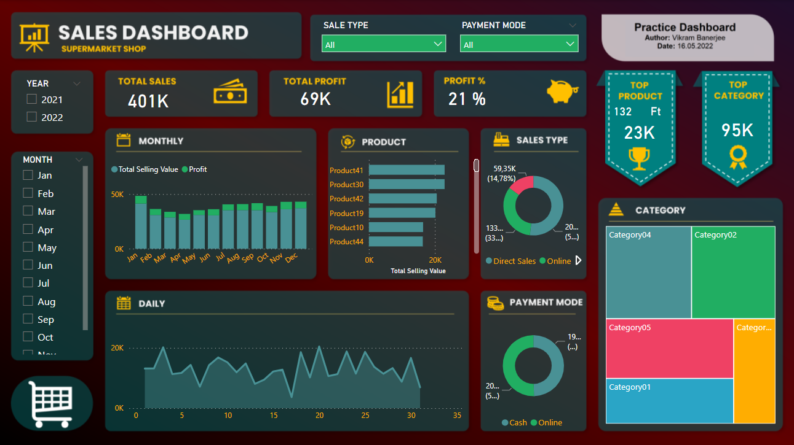

# Sales KPI Dashboard in PowerBI
Developing a sales dashboard in Power BI using Power Query to perform ETL (Extract-Tranform-Load) activities.

Author: Vikram Banerjee
Date: 16.05.2022

Dataset: Sales-Dashboard-practice-file.xlxs

Steps:

1.	Import Data to PowerBI
2.	Edit Data in Power Query Editor
3.	Create Columns & Measures
4.	Create Visuals
5.	Formant Dashboard Background
6.	Format Visuals

Creating Columns using Power Query:

1.	Total Buying Value = Sold Quantity X Unit Buying Price
Total Selling Value = InputData[QUANTITY]*InputData[MasterData.SELLING PRICE]*(1-InputData[DISCOUNT %])
2.	Total Selling Value = Sold Quantity X Unit Buying Prize X (1-Discount%)
Total Selling Value = InputData[QUANTITY]*InputData[MasterData.SELLING PRICE]*(1-InputData[DISCOUNT %])

Creating Measures using Power Query:

1.	Profit = Total Selling Value – Total Buying Value
Profit = SUM(InputData[Total Selling Value])-SUM(InputData[Total Buying Value])
2.	Profit% = Profit/Total Buying Value
Profit % = [Profit]/SUM(InputData[Total Buying Value])

For more information contact me at banerjeevikram92@gmail.com

